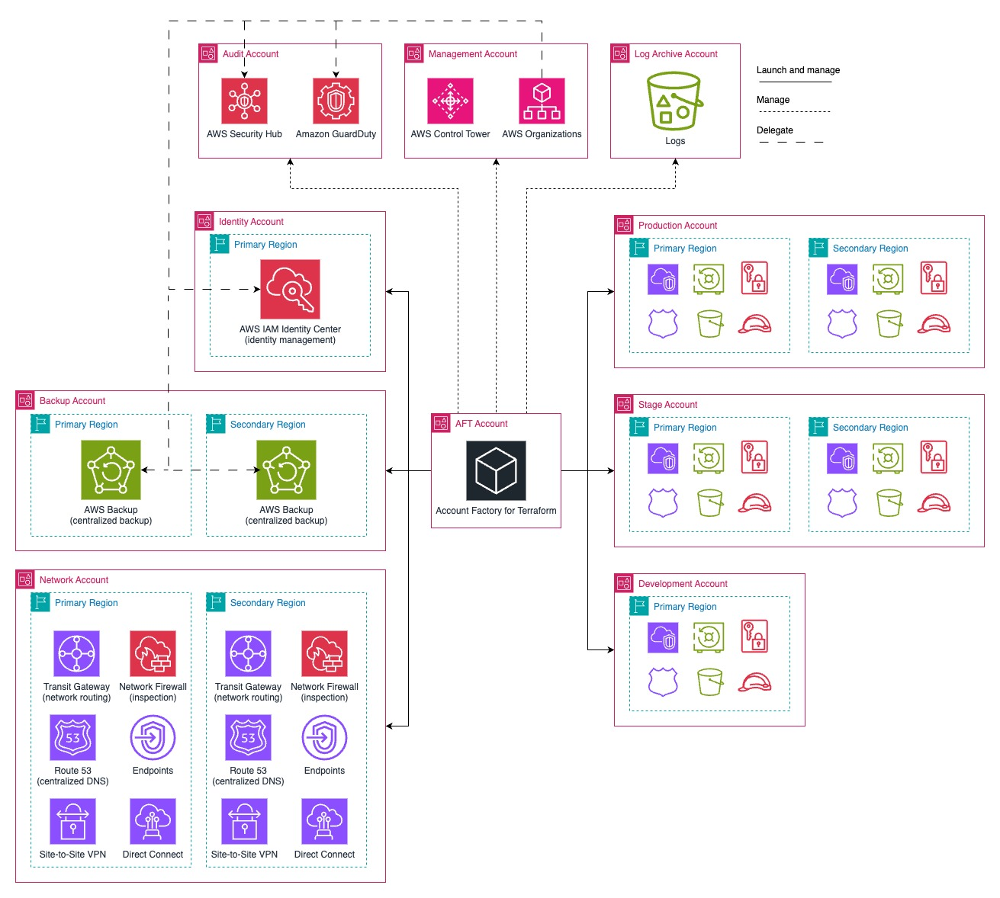

# Multi region advanced pattern

The **multi region advanced** AFT pattern provides a foundational cloud architecture, covering key services and configurations to establish a secure, multi-environment landing zone in multiple AWS Region and connecting the cloud with the on-premises environment. See the high-level target state diagram below.

## Network

At the core of the network design is a multi-region configuration, with cross-region communication facilitated through Transit Gateway peering. The pattern also features a centralized inspection VPC using AWS Network Firewall and NAT Gateway, for East-West and North-South traffic inspection. It's designed to support a full mesh routing across all spoke VPCs, for all environments, such as shared services, production, staging, and development. Ingress traffic is distributed and managed within each workload VPC on its public subnet.

Traffic between workload environments (prod, stage, dev) is sent to the inspection VPC and control is carried out via firewall rules, while traffic to/from the shared services environment (DNS, VPC endpoints, infrastructure services, etc.) is routed directly to all other environments. All VPCs make use of a centralized VPC flow logs mechanism, sending traffic logs to the Control Tower's Log Archive account.

The pattern also includes a centralized endpoints VPC to provide a cost-effective way to manage AWS private endpoint services. It VPC also includes a centralized Amazon Route 53 Resolver endpoints, which combined with Amazon Route 53 Resolver Rules provide a centralized DNS resolution mechanism.

The centralized DNS resolution architecture implemented by this pattern, provides a hybrid integration between Amazon Route 53 Private Hosted Zones (PHZ) and third-party DNS servers, enabling a bi-directional resolution mechanism. Moreover, this architecture also allows delegate for the delegation of "child" PHZs to each workload account, enabling individual teams to managed their DNS zones while still maintaining the DNS resolution across the entire organization.

Additionally, to enable effective IP management integrated with AWS services, the Network account is used as the delegated administrator of the AWS VPC IP Address Manager for the entire organization. Different IP pools are created for each environment mentioned above, making it easier to control and manage IP addresses and routing domains.

This pattern extends the network architecture to provide a path to establish a connection with an on-premises environment through either AWS Direct Connect or Transit Gateway Site-to-Site VPN, ensuring seamless and secure integration between the cloud and on-premises resources.

The entire network architecture is mirrored across all regions, ensuring that each region has the same services and resources implemented.

See more details in the [Network Advanced](../../docs/architectures/network-advanced.md){:target="_blank"} and [Centralized DNS](../../docs/architectures/centralized-dns.md){:target="_blank"} architecture pages.

## Backup

The pattern also includes a centralized backup architecture with local vaults and a central vault in a dedicated AWS Backup account, providing consolidated backup management and recovery across the environments.

See more details in the [Centralized AWS Backup](../../docs/architectures/aws-backup.md){:target="_blank"} architecture page.

## Identity Management

Additionally, the pattern sets up a delegated administrator account for the AWS IAM Identity Center and IAM Access Analyzer services. This includes a Terraform-based pipeline to dynamically deploy and manage Permission Sets, and an analyzer for external access analysis at organization level.

See more details in the [Identity Management](../../docs/architectures/identity-management.md){:target="_blank"} architecture page.

## Security

All the patterns include the same configuration for basic AWS Security services, such as AWS Security Hub and Amazon GuardDuty.

See more details in the [Security Services](../../docs/architectures/security.md){:target="_blank"} architecture page.

## Global Customizations

This pattern also includes global customizations that are applied across all accounts. These encompass the definition of the IAM password policy, as well as account-level configurations such as S3 Block Public Access, AMI Block Public Access, EBS Encryption Enforcement, and IMDSv2 Enforcement.

## Account Provisioning Customizations

No account provisioning customizations other than the AFT default are available for this pattern.

